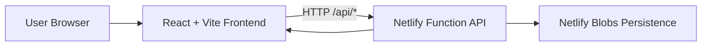

# Architecture

## High-Level Diagram

## Frontend Architecture

### Routing

- Public routes: login, register, forgot password
- Protected routes: dashboard and all app modules

Routing entry:
- [frontend/src/App.tsx](../frontend/src/App.tsx)

### State Management

Global domain state is centralized in a context provider:
- Goals
- Transactions
- Dashboard data
- Savings history
- Coach/onboarding state

Main state file:
- [frontend/src/context/DreamContext.tsx](../frontend/src/context/DreamContext.tsx)

### API Client Layer

Client API wrapper handles:
- Authorization header injection
- Session expiry handling
- Base URL resolution
- Endpoint-specific request helpers

Main file:
- [frontend/src/lib/api.ts](../frontend/src/lib/api.ts)

## Backend Architecture

### Runtime

- Single Netlify function handler
- REST-style path branching by method + URL
- CORS-enabled JSON/text responses

Main file:
- [netlify/functions/api.mjs](../netlify/functions/api.mjs)

### Persistence

- State is loaded from Netlify Blobs key db/v1.json
- Mutations write state back to Blob store
- In-memory cache is used per warm instance for speed, then persisted

### Data Model (Practical)

Stored state shape:
- usersByEmail: user records keyed by normalized email
- goalsByUser: userId to goals array
- transactionsByUser: userId to transactions array
- counters: nextGoalId, nextTransactionId

## Request Flow

1. Frontend sends request to /api/v1/*
2. Netlify redirects to function via [netlify.toml](../netlify.toml)
3. Function normalizes path and authenticates
4. Function reads/writes persisted state
5. Response returns to frontend
6. Context updates UI and local cache snapshot

## Authentication Model

- Token format currently uses a base64url payload style (dreamnest:email)
- Token is sent as Bearer token from browser local storage
- User identity is resolved from token email

## Notes

- This architecture is optimized for simple deployment and rapid iteration.
- For enterprise scale, move to managed DB with row-level auth policies.
